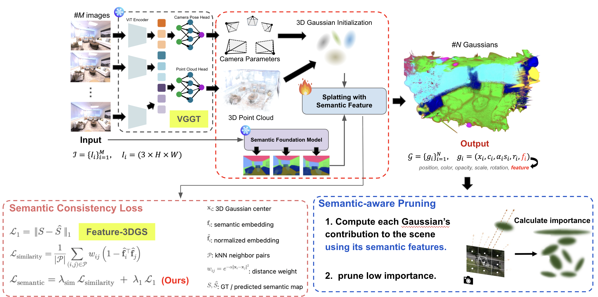
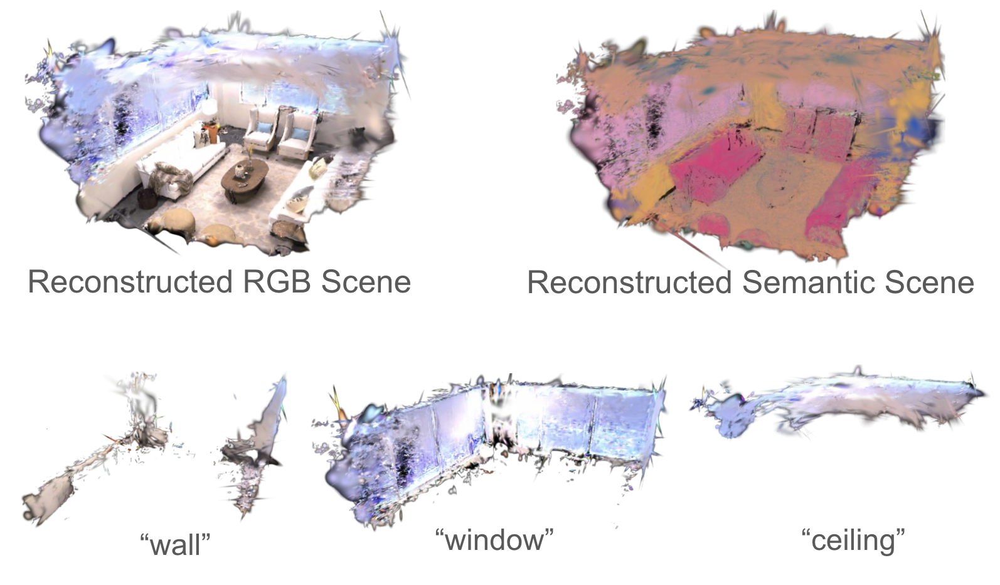

# Feed-forward 3D Reconstruction for Spatial Semantic Understanding  
**Contributors:** Minseong Kweon, Haotian Zhai, Yang Liu

## Project Overview
This repository contains the implementation of our project **Feed-forward 3D Reconstruction for Spatial Semantic Understanding**, which integrates **VGGT**, **3D Gaussian Splatting**, **semantic feature foundations**, and **semantic-aware pruning** to reconstruct and understand 3D scenes efficiently.



Our framework consists of the following components (refer to project slides for diagrams and examples):

- **Feed-forward 3D prediction using VGGT**  
  - Camera pose estimation and point cloud generation  
- **3D Gaussian initialization and rendering**  
- **Semantic feature injection** using foundation models (e.g., SAM, LSeg)  
- **Semantic Consistency Loss** to enforce feature alignment across neighboring Gaussians  
- **Semantic-aware Gaussian Pruning**  
  - Computes semantic importance and removes low-contribution Gaussians  
- **Language-driven 3D extraction**  
  - Enables querying objects such as “table”, “chair”, “window”, etc.  

This pipeline enables fast reconstruction and semantic interpretation across indoor and outdoor environments.

---

## Installation
```
pip install -r requirements/pyt201_cu118.txt
pip install -r requirements.txt
pip install -r requirements/sam.txt
```

---

## Running the Code
1. First, using the vggt submodule, extract the initial 3D point cloud and camera parameters from the dataset in COLMAP format.
2. Second, please refer to the Installation section above to install our framework’s dependencies.
3. Follow the scripts below.

##  3D Gaussian Splatting Initialization with RGB Stream
```
python main.py fit --data.path ./datasets_vggt/gopher/ -n gopher-3dgs
```

##  First feature distilation with semantic feature & Semantic-aware pruning
1. Using the Feature-3DGS submodule, extract the semantic features from the given RGB images.
2. With the RGB images, semantic features, and camera parameters, run the script below.
```
python main.py fit  --config configs/feature_3dgs/lseg_semantic_lightgaussian.yaml  --data.path ./datasets_vggt/gopher --model.initialize_from outputs/gopher-3dgs/ -n gopher-1stage
```
##  Second semantic feature distilation after pruning

```
python main.py fit  --config configs/feature_3dgs/lseg-speedup_second.yaml  --data.path ./datasets_vggt/gopher --model.initialize_from outputs/gopher-1stage/ -n gopher-2stage
```
##  Rendering Test images
```
python main.py test --config ./outputs/gopher-2stage --save_val
```
##  Web Viewer
```
python viewer.py ./outputs/gopher-2stage
```

## Demo
